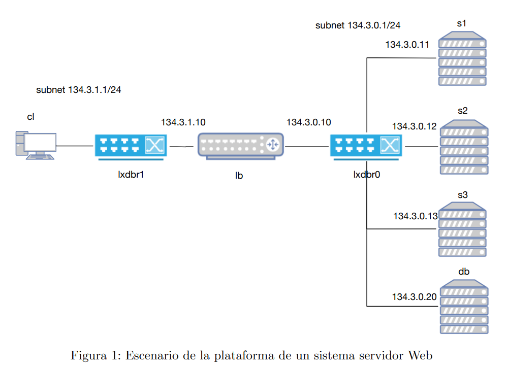

# Proyecto: PRACTICA 2 ARSO

## Descripción

El objetivo de esta práctica es desplegar y configurar una aplicación con interfaz web. Además, se propone una actividad
opcional para desplegar y arrancar un servidor de una base de datos en un computador remoto.



## Requisitos

Para trabajar en este proyecto, asegúrate de tener instalado:

- Git
- Python 3.x
- Node.js
- MongoDB

## Instalación

Para descargar el repositorio en tu PC, sigue estos pasos:

```bash
# Clonar el repositorio
git clone https://github.com/javisan17/practica2-arso.git

# Entrar en la carpeta del proyecto
cd practica2_arso

```

## Flujo de trabajo con Git

Igual que la anterior práctica.

## Contacto

Si tienes dudas o problemas, háblame por WhassApp :).
